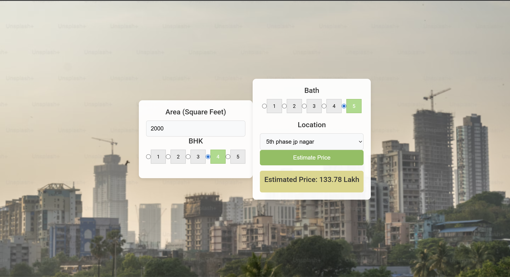

# Realestate_prediction_using_ml

# 🏠 Real Estate Price Prediction - Bangalore

A machine learning web application that predicts house prices in Bangalore based on user-provided features. Built using **Linear Regression** and deployed with a clean **Flask + HTML/CSS/JS** frontend.

## 📊 Project Overview

- 📂 Dataset: Sourced from Kaggle (Bangalore House Price Data)
- 🧠 ML Model: Linear Regression (using scikit-learn)
- 🛠️ Tech Stack: Python, Pandas, NumPy, Scikit-learn, Flask, Pickle, HTML, CSS, JavaScript, JSON

## 💡 Features

- Predicts house price based on:
  - Location
  - Area (sqft)
  - Number of bedrooms (BHK)
  - Number of bathrooms
- Simple and interactive GUI
- Real-time predictions using a trained ML model

## 🚀 How it Works

1. User inputs property details in the web interface.
2. The data is sent to a Flask backend.
3. The ML model (loaded via Pickle) processes the input and returns a price.
4. The predicted price is displayed on the UI.

## 🖼 GUI Preview

## 🧪 How to Run

1. Clone the repo  
2. Install dependencies  
3. Run the Flask server  
4. Open the web interface in browser
